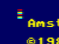
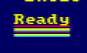
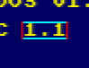
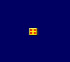

# RETO 1.P11: Domina la memoria de vídeo
Copia más abajo tus programas, cada uno en su parte del reto.

# PROGRAMAS

## Actividad 1: Dibujo de 4x8 píxeles
Las 8 primeras fílas de pantalla, de distintos colores
```
3E FF 32 00 C0 32 00 E0 3E 00 32 00 C8 32 00 E8 3E F0 32 00 D0 32 00 F0 3E 0F 32 00 D8 32 00 F8 18 FE
```
PC: 4000

## Actividad 2: Subrayar 'READY' de colores
8 filas de píxeles de distintos colores subrayando toda la palabra de Ready (40 píxeles)
```
3E FF 32 70 C3 32 71 C3 32 72 C3 32 73 C3 32 74 C3 32 75 C3 32 76 C3 32 77 C3 32 78 C3 32 79 C3 32 70 E3 32 71 E3 32 72 E3 32 73 E3 32 74 E3 32 75 E3 32 76 E3 32 77 E3 32 78 E3 32 79 E3 3E 00 32 70 CB 32 71 CB 32 72 CB 32 73 CB 32 74 CB 32 75 CB 32 76 CB 32 77 CB 32 78 CB 32 79 CB 32 70 EB 32 71 EB 32 72 EB 32 73 EB 32 74 EB 32 75 EB 32 76 EB 32 77 EB 32 78 EB 32 79 EB 3E F0 32 70 D3 32 71 D3 32 72 D3 32 73 D3 32 74 D3 32 75 D3 32 76 D3 32 77 D3 32 78 D3 32 79 D3 32 70 F3 32 71 F3 32 72 F3 32 73 F3 32 74 F3 32 75 F3 32 76 F3 32 77 F3 32 78 F3 32 79 F3 3E 0F 32 70 DB 32 71 DB 32 72 DB 32 73 DB 32 74 DB 32 75 DB 32 76 DB 32 77 DB 32 78 DB 32 79 DB 32 70 FB 32 71 FB 32 72 FB 32 73 FB 32 74 FB 32 75 FB 32 76 FB 32 77 FB 32 78 FB 32 79 FB 18 FE
```
PC: 4000

## Actividad 3: Rectángulo de 2 colores y 2 píxeles de ancho
Alrededor del texto `1.1` que va después de BASIC.
```
21 43 77 22 00 C8 18 FE
```
PC: 4000

## Actividad 4: Cara de un dado de 8x7 píxeles
Debe estar, más o menos, en el centro de la pantalla (no tiene porqué ser exacto)
```
21 43 77 22 00 C8 18 FE
```
PC: 4000

# IMAGENES





